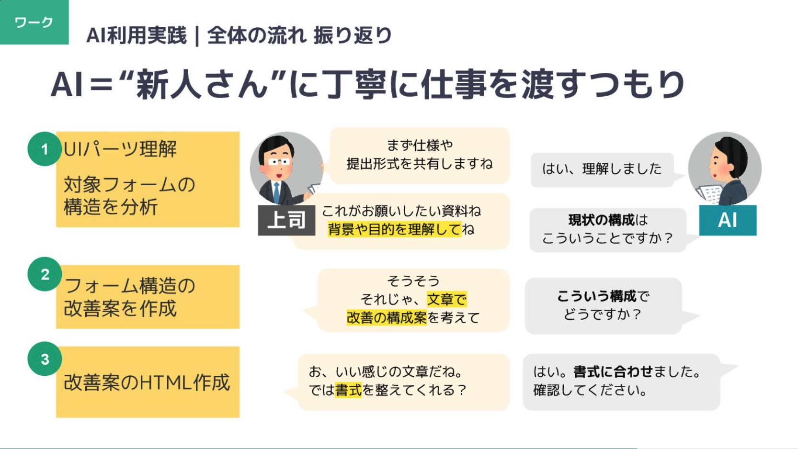

# CGFM AI Workshop Prompts

AI 活用ワークショップで使用した **実務向けプロンプトセット** を公開しています。
自治体・企業での改善業務にあわせて、必要なセットをご活用ください。

---
## 前提条件

本プロンプト集は、
多くの自治体で標準的に利用されている **Microsoft Office Copilot（ChatGPT-5 相当モデル）** での動作を前提
として設計しています。
（2025年11月時点の情報に基づきます）

---
## 📚 含まれるプロンプトセット

### 1. [electronic-form-intermediate（電子申請・中級編）](electronic-form-intermediate/README.md)
電子申請フォームの構造改善・UI改善を、AIを用いて効率的に行うためのプロンプトセットです。

### 2. [webpage-improvement-ai（Webページ改善）](webpage-improvement-ai/README.md)
自治体Webページの構造整理・本文リライト・アクセシビリティ改善を AI で支援するプロンプトセットです。

### 2つのプロンプトの違い


| 項目 | 電子申請 - 中級編 | Webページ改善 |
|------|------------------|---------------------------|
| 対象 | 入力フォーム（電子申請） | 情報ページ（Web記事・案内・行政ページ） |
| ゴール | 入力しやすいフォーム設計 | 読みやすい・迷わない情報構造 |
| 主な課題 | 入力負荷・UIパーツ選択・順序 | 情報過多・構造不足・アクセシビリティ |
| 出力成果物 | HTMLフォーム、UI改善案、文言 | H2〜H5構造＋本文リライト |
| 必要ステップ | 3ステップ | 4ステップ |
| 難易度 | 中級（フォーム改善に特化） | 中級〜上級（構造化＋文章力） |

---

## 🧭 推奨ガイドライン（共通事前準備）

AI が正しく判断できるよう、以下のガイドラインを事前に読み込みさせてください。

◆ デジタル庁：デジタル社会推進標準ガイドライン
  https://www.digital.go.jp/resources/standard_guidelines  
特に役立つ資料：
  - **自治体サイトのユーザビリティ改善に関する文書**  
  - **Webアクセシビリティ関連ガイドライン**

◆ 自治体独自ガイドラインがある場合

自治体独自のホームページ運用ガイドラインや表記基準がある場合、
必ずそちらを優先して読み込ませてください。

（AI に渡す際のファイル名は「ガイドライン資料.pdf」のように抽象名でOK）

---

## 📁 ディレクトリ構成

```
cgfm-ai-workshop-prompts/
├─ README.md
├─ LICENSE
│
├─ electronic-form-intermediate/
│  ├─ README.md
│  ├─ Step1.md
│  ├─ Step2.md
│  ├─ Step3.md
│  └─ フォームUI選択辞書.md
│
└─ webpage-improvement-ai/
   ├─ README.md
   ├─ Step1.md
   ├─ Step2.md
   ├─ Step3.md
   └─ 事前準備.md
```
---


## 💡 プロンプト思想イメージ



プロンプトの設計思想として、「業務の背景理解は浅いが、実務能力が非常に高い**優秀な新人=生成AI**」に、より質の高いアウトプットをしてもらうため、丁寧に仕事内容を伝えることを重視しています。

AIに対して、単に「HTMLを書いて」と伝えるのではなく、  
- **目的**（何を実現・解決したいのか）
- **背景**（現状の課題や制約）
- **ステップ構造**（構造分析→改善案→HTML生成...等、一連の流れ）

といった“文脈”や“仕事の目的”をセットで渡すことで、AIは意図や全体像を理解しやすくなり、より的確な提案や生成結果を出しやすくなります。

本リポジトリでは、この設計方針を反映し、誰でも同じ流れを再現できるよう（Step1→Step3 など）、一連のプロンプトをパッケージ化しています。


---

## 🔗 ライセンス
本リポジトリは MIT License で公開しています。
商用利用・改変・二次利用すべて可能です（著作権表示の保持が条件）。

## 問い合わせ先
合同会社CGFM info@cgfm.jp