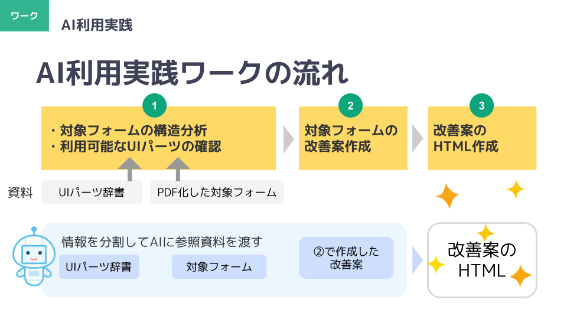
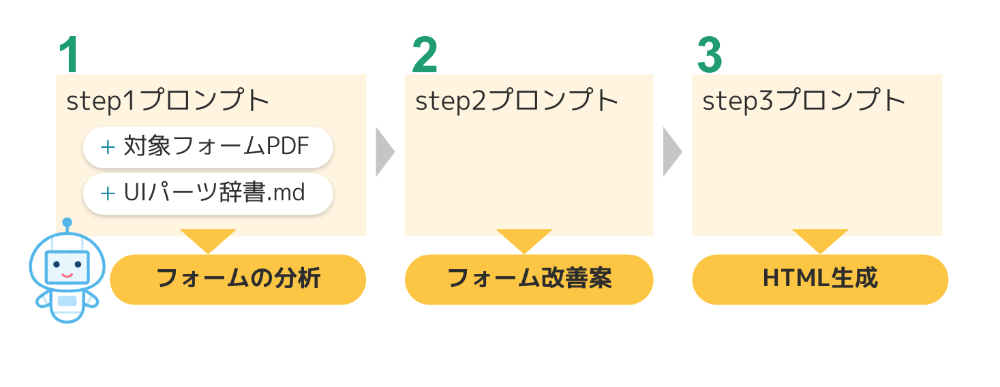

# 電子申請・中級編（electronic-form-intermediate）

このセットは、AI（Copilot / ChatGPT-5）を使って  
**電子申請フォームの構造分析 → 改善案作成 → HTML生成**  
までを一連の流れで行うためのプロンプト集です。

プロンプトは **Step1 → Step2 → Step3 の順にコピペして実行**するだけで利用できます。

##  ワークの全体像（画像）

 

---


##  事前準備（重要）

この「電子申請・中級編」で必要な事前準備は次の 2 つだけです。

1. **対象フォーム（PDF / 画像 / HTML / URL）**   **【必須】**
2. **フォームUI選択辞書.md**  
   - AIが適切なUIパーツを選べるようにするための辞書ファイルです。
   ブラウザ標準 + 自治体CMSで一般的なUIを収録しています。

※ ガイドライン（自治体独自 / デジタル庁PDF など）は不要です  
　（高度な判断が必要な時だけ任意で読み込ませてもOK）

---

## 利用手順（Step1 → Step3 の順に実行）


 


### **Step1：フォームの構造分析**

1. 次の2つのファイルを **AI に添付** します  
   - **対象フォーム（PDF / 画像 / HTML）【必須】**  
   - **フォームUI選択辞書.md【必須】**  
2. `Step1.md` 内のプロンプトを **そのまま AI にコピペして実行** します 
3. AI が対象フォームの  
   - 入力項目  
   - 構造（ブロック・グループ）  
   - UIの問題点・気づき  
   を整理した「構造分析メモ」を生成します  
---

### **Step2：フォーム改善案の作成**
1. `Step2.md` のプロンプトを **そのまま AI にコピペして実行** します  
2. AI が、Step1 の構造分析をもとに  
   - UIパーツの選択  
   - 順序・グルーピングの最適化  
   - 説明文・注意文の整理  
   を考慮した「改善案（紙芝居ドラフト）」を生成します
3. 出力が長い場合は、AI が自動的に分割して回答します  
   （分割された場合は「続けて」と依頼してください）

---

### **Step3：改善後HTMLの生成**
1. `Step3.md` を **そのまま AI にコピペして実行** します  
2. Step2 の改善案（紙芝居ドラフト）を続けて貼り付けます  
3. AI が **HTML + CSS の静的フォーム** を生成します  

📌 **確認方法**  
- 生成されたHTMLをローカルPCに保存すると、そのままブラウザで閲覧できます  
- 最終的なレイアウト調整や、CMS／電子申請システム特有の処理は **各システム上で改めて行ってください**
---

## 📚 含まれるファイル

```text
electronic-form-intermediate/
├─ README.md               ← この説明ファイル
├─ Step1.md                ← 構造分析プロンプト
├─ Step2.md                ← 改善案作成プロンプト
├─ Step3.md                ← HTML生成プロンプト
└─ フォームUI選択辞書.md   ← UIパーツ辞書（必ずAIに添付）
```

## 補足資料
このプロンプトを利用した、2025年11月に熊本市様向けに行ったUIデザイン研修ワークショップのスライドを公開しています

[ ](https://speakerdeck.com/garyuten/gong-kai-suraido-xiong-ben-shi-yang-dian-zi-shen-qing-zhong-ji-bian)

## 問い合わせ先
合同会社CGFM info@cgfm.jp