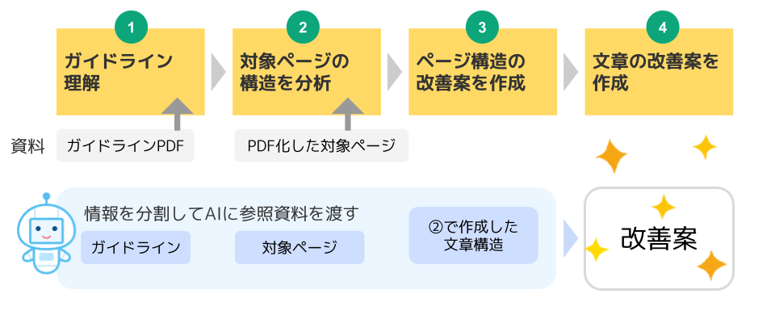

# Web ページ改善（webpage-improvement-ai）

このプロンプトセットは、自治体サイト・企業サイトに共通する  
**「ページ構造の分析 → 改善構造案 → 本文リライト」**  
の一連の作業を、AI（Copilot / ChatGPT-5）で再現するための  
**業務支援テンプレート兼ワークショップ教材**です。

---

## 📘 このセットでできること

これらを AI が自動生成することを前提に設計しています。
- ページ構造の棚卸し（H2〜H5 での階層化）
- 情報の過不足・迷いやすさの分析
- スマホ視認性を意識した構造改善案の作成
- 行政文書としての品質に合わせた本文リライト
- PREP法＋5W3H を織り込んだ読みやすい文章生成
- Step1 → Step3 の段階的プロセスにより、  
  **内部検討しやすい“たたき台”を可視化**
---

## ✔ 事前準備

**必ず読み込ませる必要があるファイルは 1 つだけです。**

1. **改善対象の Web ページ（URL / HTML / PDF）【必須】**

必要最低限の動作はこれだけで可能です。

---

### 📘（推奨）精度を高めたい場合は、次の PDF も読み込ませてください

自治体の実務では、ページ構造・表現ルールの品質担保が重要なため、  
ガイドラインを併せて読み込ませることで Step2・Step3 の精度が向上します。

- 自治体独自の **ホームページ運用ガイドライン（PDF等）**
- デジタル庁の [デジタル社会推進標準ガイドライン](https://www.digital.go.jp/resources/standard_guidelines) からウェブサイト関連の推奨ガイドライン
  - [DS-680.1 ウェブサイトガイドライン（PDF）](https://www.digital.go.jp/assets/contents/node/basic_page/field_ref_resources/e2a06143-ed29-4f1d-9c31-0f06fca67afc/cbd5b6f6/20250930_website_guidelines.pdf)
  - [DS-680.2 ウェブコンテンツガイドライン（PDF）](https://www.digital.go.jp/assets/contents/node/basic_page/field_ref_resources/e2a06143-ed29-4f1d-9c31-0f06fca67afc/a02f877e/20250930_web_content_guidelines.pdf)
  - [DS-670.1 ユーザビリティガイドライン（PDF）](https://www.digital.go.jp/assets/contents/node/basic_page/field_ref_resources/e2a06143-ed29-4f1d-9c31-0f06fca67afc/ae97c671/20250930_usability_guidelines.pdf)


---

## ▶ 利用手順（事前準備 → Step1 → Step3）



### **事前準備：ガイドライン理解（任意だが推奨）**
1. **ホームページ運用ガイドラインを AI に添付**
2. `事前準備.md` を **そのまま AI にコピペして実行**
3. AI がガイドラインを学習し、後続の Step の精度が向上します

### **Step1：現行ページの構造分析**

1. **対象ページ（URL / HTML / PDF）【必須】を AI に添付**
2. `Step1.md` を **AI にコピペして実行**
3. AI が次を整理した「構造分析メモ」を生成します
   - 課題点（迷いやすい箇所）
   - H2〜H5 の階層候補
   - 情報の過不足
   - UI/レイアウトの問題

---

### **Step2：改善構造案の作成**

1. `Step2.md` を **AI にコピペして実行**  
   （AI は Step1 の分析結果をそのまま参照します）
2. AI が、Step1 の構造分析をもとに **改善後のページ構造（改善構造案）** を生成します。  
   具体的には次の内容が統合されます：
   - H2〜H5 の階層構造の整理
   - 情報の並び順・優先順位の最適化
   - 注意文・補足文の要約・統合・適正化
   - スマホ視認性に配慮した構造調整
3. 出力が長文になる場合、AI が自動で分割して回答します。
   （分割された場合は「続けて」と依頼してください）
---

### **Step3：本文リライト（行政文書向け）**

1. `Step3.md` を **AI にコピペして実行**
2. Step2 の改善構造案をもとに、AI が以下を統合して **Web 掲載用本文** を生成します
   - PREP 法
   - 5W3H
   - 対象を明確に、優しいトーンで
3. 長文の場合、**H2ごとに分割して作成される**ため実務で使いやすい文章になります
---

## 📁 含まれるファイル

```
webpage-improvement-ai/
├─ README.md
├─ 事前準備.md
├─ Step1.md
├─ Step2.md
└─ Step3.md
```